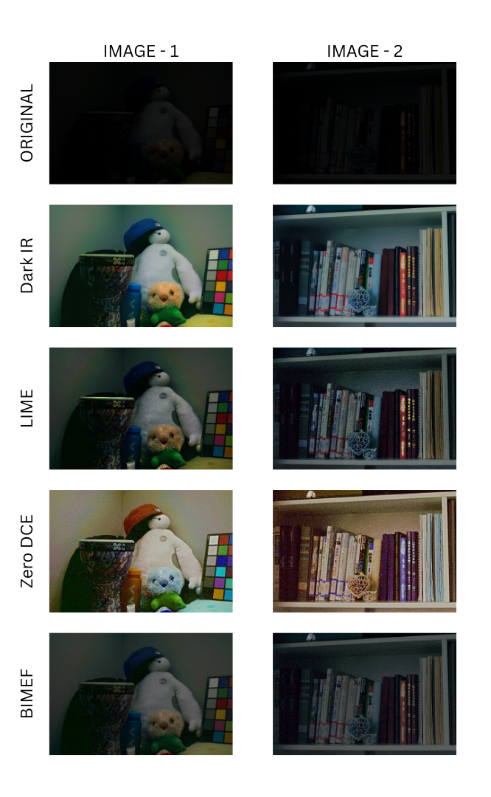

# Image Restoration and Object Recognition in Low-Light Environments

In this project, we focus on improving image restoration and subsequent object recognition in challenging low-light environments. We implemented four different methodologies, including both deep learning-based and traditional computer vision-based techniques.

## Methodologies

1. **Low-Light Image Enhancement via Illumination Map Estimation (LIME)**  
   This method estimates the illumination map of a low-light image and enhances the image using structure-aware smoothing.

2. **A Bio-Inspired Multi-Exposure Fusion Framework for Low-light Image Enhancement**  
   A traditional CV-based approach that mimics the human visual system by fusing multiple exposure levels to enhance visibility.

3. **DarkIR**  
   A deep learning-based model that enhances low-light images using an IR-guided deep restoration framework.

4. **Zero-Reference Deep Curve Estimation (Zero-DCE)**  
   A deep learning approach that performs curve estimation on the image without requiring paired training data or reference images.

## Model Comparison

We tested all four models on a set of low-light images and evaluated their performance in terms of visual quality and object recognition accuracy. Below is a visual comparison of results across different methods.

## Live Demo

The working application is hosted at:  
[https://image-enhancement-csl7630.streamlit.app/](https://image-enhancement-csl7630.streamlit.app/)

---

## References

- LIME: Xu, L., Ren, W., et al. "Low-Light Image Enhancement via Illumination Map Estimation", *IEEE Transactions on Image Processing*, 2017. [https://ieeexplore.ieee.org/document/7847173](https://ieeexplore.ieee.org/document/7847173)
- Bio-Inspired MEF: Ying, Z., et al. "A Bio-Inspired Multi-Exposure Fusion Framework for Low-light Image Enhancement", *ACM Multimedia*, 2017. [https://dl.acm.org/doi/10.1145/3123266.3123412](https://dl.acm.org/doi/10.1145/3123266.3123412)
- DarkIR: Wu, T., et al. "DarkIR: A Deep Infrared Prior for Low-Light Image Enhancement", *CVPR Workshops*, 2022. [https://openaccess.thecvf.com/content/CVPR2022W/NTIRE/html/Wu_DarkIR_A_Deep_Infrared_Prior_for_Low-Light_Image_Enhancement_CVPRW_2022_paper.html](https://openaccess.thecvf.com/content/CVPR2022W/NTIRE/html/Wu_DarkIR_A_Deep_Infrared_Prior_for_Low-Light_Image_Enhancement_CVPRW_2022_paper.html)
- Zero-DCE: Guo, C., et al. "Zero-Reference Deep Curve Estimation for Low-Light Image Enhancement", *CVPR*, 2020. [https://openaccess.thecvf.com/content_CVPR_2020/html/Guo_Zero-Reference_Deep_Curve_Estimation_for_Low-Light_Image_Enhancement_CVPR_2020_paper.html](https://openaccess.thecvf.com/content_CVPR_2020/html/Guo_Zero-Reference_Deep_Curve_Estimation_for_Low-Light_Image_Enhancement_CVPR_2020_paper.html)

---

## Contributors

**Submitted by:**
- Arjun Arora (M24CSA003)  
- Nivedita Gupta (M24CSE017)  
- Prateek (M24CSA022)  
- Shreya Pandey (M23CSA030)  

**Supervisor:**  
Dr. Pratik Mazumder
